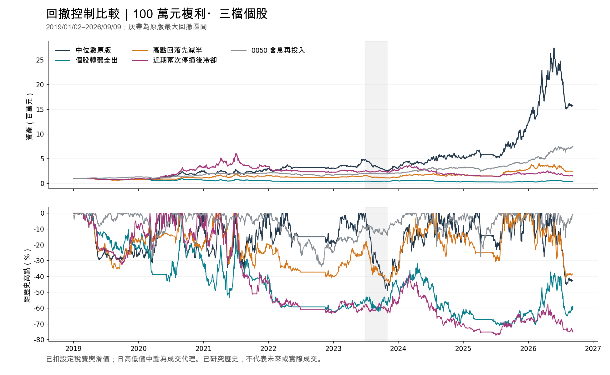

# 回撤控制：中位數流動性策略的完整帳戶比較

研究日期：2026-10-01。以原 **+1,472.77%** 中位數流動性版本為基準；**2019-01-02–2026-09-09、本金100萬元複利、三個主要持股名額、普通個股、閒置現金**。少量待清零股可能另占實體持股；0050僅是獨立比較帳戶。所有規則在新績效公布前固定，沒有看到結果後再加組合或調參。

**本輪沒有找到兼顧原版報酬與回撤的替代方案。** 高點回落減半僅將最大回撤降低4.41個百分點，累積報酬卻由+1,472.77%降至+150.23%；其餘兩組連最大回撤都惡化。三組新增規則均輸給0050，維持為未通過的研究，原版仍有尚未解決的大回撤。

## 完整結果

| 版本 | 扣成本累積報酬 | 期末資產（元） | 最大回撤 | 買入批次 | 成交筆數 | 總成本（元） | 贏0050年度 |
| --- | --- | --- | --- | --- | --- | --- | --- |
| 中位數原版 | +1472.77% | 15,727,740 | -48.87% | 130 | 742 | 2,711,059 | 4/8 |
| 個股轉弱全出 | -57.73% | 422,679 | -72.17% | 220 | 1093 | 462,693 | 1/8 |
| 高點回落先減半 | +150.23% | 2,502,300 | -44.46% | 124 | 1480 | 853,555 | 3/8 |
| 近期兩次停損後冷卻 | +53.31% | 1,533,103 | -77.06% | 126 | 697 | 1,189,524 | 1/8 |
| 0050 含息再投入 | +643.31% | 7,433,140 | -33.91% | 0 | 54 | 9,584 | — |

報酬包括期末持股與待收權益的估值，未假設截止日全部變現。成本包含設定佣金、股票／ETF交易稅及滑價；不是已核實的真人成交。

## 原版為什麼回撤這麼大

最深區間是 **2023/6/29–10/31**：資產從4,891,259.95元降到2,500,890.94元，減少2,390,369.01元；0050同期約跌4.70%。這不是本金100萬元虧掉48.87%，而是從累積資產高點回撤48.87%。直到2024/6/18才回到原高點，經過236個交易日。

原來的12%收盤停損看的是買入首日還原收盤參考價；它沒有設定自股價高點回落的保護。因此仍高於買入參考價的贏家，可以先回吐大量獲利，再因63日期限離場。12%也不是含費成交成本或全帳戶損失的保證上限。

| 股票 | 高點時占帳戶 | 該回撤區間損益（元） |
| --- | --- | --- |
| 2630 亞航 | 35.98% | -707,736 |
| 6625 必應 | 34.10% | -583,963 |
| 2913 農林 | 0.00% | -174,284 |
| 8068 全達 | 0.00% | -166,083 |
| 3308 聯德 | 0.00% | -142,850 |
| 3583 辛耘 | 0.00% | -142,800 |

亞航、必應合計占高點資產約70.08%，回吐合計約129.17萬元，占這次帳戶損失54.04%。兩檔最後仍小賺離場，與「曾經回吐很多」並不矛盾。區間後續又新買9批，造成另一段損失。歸因使用持股市值差、現金流及應收變動，現金股利付款不會再重算一次獲利。

可計算20日均線且有量的歷史合格股票中，站上20日均線比例從53.75%降到25.55%；0050卻在這85個觀察日中有68日在120日均線上。這說明僅靠0050均線判斷，未能避開此段個股帳戶回撤。這是當次現象，不是已驗證的新市場寬度濾網。

## 三種機制

1. **個股轉弱全出**：連續兩個收盤低於20日均線，且20日報酬弱於0050，隔日提出全出。原12%停損與63日期限先判斷。
2. **高點回落先減半**：沿用既有15%高點回落規則，收盤觸發、隔日減半；餘部仍占名額，減半訊號之後再有連續兩個收盤低於60日均線，隔日全出。原停損／到期仍優先。高點使用持有後已知價格並調整公司行動。
3. **近期兩次停損後冷卻**：20個交易日內，兩個不同批次首次實際執行12%停損後，下一交易日起暫停新買10個交易日；已有持股正常退出。部分成交不重複計次，新停損可以延長，舊事件不會無限重設倒數。

全部保持同一個候選池與排序。提早退出會改變名額、現金、股數和以後買到的股票，因此都重跑完整帳戶，沒有把某些虧損交易刪除後相加。恢復買入只接受原選股法的新訊號，沒有額外放寬的買回條件。

## 回撤與復原

| 版本 | 自身高點→谷底 | 回到前高 | 高點到復原交易日 | 原版2023回撤區間報酬 | 平均已交付持股比重 |
| --- | --- | --- | --- | --- | --- |
| 中位數原版 | 2023-06-29 → 2023-10-31 | 2024-06-18 | 236 | -48.87% | 73.10% |
| 個股轉弱全出 | 2019-02-25 → 2025-09-26 | 截止仍未恢復 | — | -5.84% | 62.70% |
| 高點回落先減半 | 2021-07-08 → 2023-11-13 | 2024-07-16 | 736 | -27.85% | 53.20% |
| 近期兩次停損後冷卻 | 2021-07-02 → 2025-07-02 | 截止仍未恢復 | — | -11.88% | 63.47% |
| 0050 含息再投入 | 2022-01-17 → 2022-10-25 | 2024-02-15 | 500 | -4.70% | 99.70% |

平均持股比重為每日已交付股票市值／資產，不含未交付配股的價格風險。各版本最大回撤可能發生在不同年份；不能只檢查原版最差的2023區間。

三組都減輕了原版2023/6/29–10/31的損失，但整段表現仍未改善。例如轉弱全出把該段跌幅降到5.84%，全期最大回撤卻變成72.17%。減半版自己的最深回撤從高點到復原耗時736個交易日，也長於原版自身最深回撤的236日。各自對應不同區間，這不是同一段市場下的純粹出場效果。

## 各年度與連續三段

| 版本 | 2019 | 2020 | 2021 | 2022 | 2023 | 2024 | 2025 | 2026至9/9 |
| --- | --- | --- | --- | --- | --- | --- | --- | --- |
| 中位數原版 | -21.49% | +215.47% | +21.50% | +2.10% | +0.74% | +82.92% | +116.73% | +28.17% |
| 個股轉弱全出 | -19.39% | -14.60% | -11.08% | -36.65% | +41.08% | -26.43% | -4.12% | +9.51% |
| 高點回落先減半 | -14.69% | +35.70% | +37.26% | -25.51% | +5.84% | +41.69% | +62.62% | -13.32% |
| 近期兩次停損後冷卻 | -2.06% | +233.47% | +4.14% | -33.00% | +13.99% | -28.79% | +9.55% | -24.34% |
| 0050 含息再投入 | +34.01% | +31.16% | +22.05% | -21.32% | +27.44% | +48.36% | +36.80% | +70.25% |

| 版本 | 2019–2021 | 2022–2024 | 2025–2026/9/9 |
| --- | --- | --- | --- |
| 中位數原版 | +200.93% | +88.14% | +177.79% |
| 個股轉弱全出 | -38.78% | -34.24% | +5.00% |
| 高點回落先減半 | +58.90% | +11.71% | +40.96% |
| 近期兩次停損後冷卻 | +240.10% | -45.61% | -17.12% |
| 0050 含息再投入 | +114.53% | +48.77% | +132.89% |

每段接續同一帳戶，不重置本金；這些年份都已反覆研究，分段不是新的未見測試，也不是彼此獨立的市場樣本。

## 主要獲利波段是否保留

下表按「同股票、持有日期與原版獲利波段重疊」比對，允許不同日買進。數字是各批次完整淨損益的合計，受先前帳戶本金、持有量及日期影響；不是固定投入金額下的純出場效果，也不是共同區間報酬。

| 原版獲利波段 | 原版淨利（元） | 轉弱全出 | 高點回落減半 | 停損後冷卻 |
| --- | --- | --- | --- | --- |
| 5386 青雲 2026-02-10 | 11,400,508 | 243,542 | 未買到重疊波段 | 未買到重疊波段 |
| 2408 南亞科 2025-10-29 | 3,230,402 | 134,108 | 488,430 | 450,920 |
| 2344 華邦電 2025-09-22 | 2,553,963 | 未買到重疊波段 | 未買到重疊波段 | 未買到重疊波段 |
| 8358 金居 2025-07-25 | 1,805,446 | 未買到重疊波段 | 498,938 | 未買到重疊波段 |
| 8299 群聯 2025-10-07 | 1,552,482 | 未買到重疊波段 | 未買到重疊波段 | 未買到重疊波段 |

## 轉弱全出為何反而更差

原版130批買入增加到220批，已結束批次勝率由44/127（34.65%）降到62/217（28.57%）。這不是完全沒買到飆股：青雲2026年波段仍有買到，但前面本金已減少，該波段淨利只剩約24.35萬元，相較原版約1,140.05萬元，複利路徑已大幅不同。

兩個同日進場的實例：台達化2020/6/4進場，原版持至9/7扣費報酬約+64.37%，轉弱版7/3先出約-3.33%；金麗科2020/9/25進場，原版持至12/28約+82.27%，轉弱版10/29先出約-4.86%。轉弱版兩次都是新增均線規則觸發。這些是事後解釋，不能據此指定例外股票保留。

## 減半與冷卻的代價

減半版已結束批次的勝率提高到47/121（38.84%），但勝率提高沒有換來更高總報酬。此帳戶沒有持有原版青雲、華邦電、群聯的主要獲利波段；南亞科相同日期的投入金額及保留部位也不同，整段淨利由約323.04萬元縮至48.84萬元。這包含資金與名額路徑差異，不能全部歸因為「少持有一半」。

冷卻版全期有419個交易日禁止新買，擋下6,979個候選事件；這些數字不是避免虧損的次數，候選本來也未必有名額成交。它在2019–2021累積+240.10%，但2022–2024為-45.61%，2025–2026/9/9為-17.12%。休息沒有阻止舊持股與後續買入路徑的長期回撤。

冷卻版錯過青雲也不能直接說是「訊號當天還在休息」：2026/2/10冷卻已解除，實際拒單原因是`slots_full`；華邦電2025/9/22亦因名額已滿。這是較早決策改變持股組合之後的間接效果，與硬把特定飆股加入例外不同。

## 成交與資料口徑

- 收盤後才有訊號，最早下一交易日執行；買賣均採各自普通盤／零股日高低價中點代理。2020/10/26以前使用盤後零股，沒有假造盤中零股。高低價中點不能預先知道或保證成交。
- 普通盤可成交量不超過當日量與前20日均量較小者的1%，零股同樣採該渠道1%容量，保留未成交及部分成交。舊帳戶設定殘留的`odd_participation=0.05`與此版實際訂單不同；發布器核對全部成交均為0.01並明示此差異，為保持原版逐欄重現而未重寫舊帳戶。
- 每邊0.45%滑價、0.1425%佣金、每渠道最低20元，個股賣出稅0.3%；0050比較帳戶按ETF稅率。個人股利稅、補充保費與未核實郵匯費未完整模擬。
- 配股、股利及退款只在可交付時影響可用股數／現金。緯穎2026/9/2除權，依已有日期的股務證據，截至9/9仍列不可賣應收股份，以普通股價代理估值。9/10是證據涵蓋邊界，並非發放日，延長回測會拒絕。
- 補上2023/8/3休市對應的26筆官方除權息與台企銀、台星科、円星的配股交付條款；冷卻版的茂迪減資沿用已核對交換與退款處理。円星不足一股按面額折現至整元，實際零碎股款付款日仍採交付日假設，明確保留未核實標記。
- 準備階段先補來源，不發布新策略報酬。新增均線規則的獨立核對曾攔下浮點精度把相等價格視為跌破，修正僅限1e-12數值容差；沒有搜尋交易門檻。

## 核對、驗收與適用範圍

五組各兩次完整離線回測，現金、交易、持股、每日資產、審計及來源一致。原版與0050另外要求逐欄重現上一輪封存帳戶。重跑一致是可重現性證據，不是兩次樣本外獲利。新增均線決策使用前日以前價格，冷卻判斷使用已執行停損，並有未來價格不可改變過去決策、部分成交去重、冷卻期間禁止買進及配股估值測試。

完整`make test`：4,255項通過。最後整合後`make pipeline`完成，另有兩次成功重跑；原先10/1 TAIEX更新延遲已在本輪解除。既有8000服務及新啟動8001測試服務的health、picks、models、jobs四端點均HTTP200，測完僅停止本次8001。沒有下單、沒有啟動排程。

共保留26筆執行紀錄：16次準備（包含缺件、來源錯誤與一次初始化主動中止）、10次正式帳戶回測。來源準備共266次嘗試，其中90次FinMind、171次官方零股、5次公司公告／文件，低於500次預設上限；可能命中共用快取，不能直接當作計費請求數。FinMind沿用每小時5,400次共用限制，兩次HTTP520中斷各經核對後只重試一次，沒有自動重試。正式回放禁止網路，未重訓模型。

本次補齊的是這些固定帳戶路徑。歷史市場名冊仍屬重建、日資料不是委託排隊證據、部分零碎款日期仍有假設，整段歷史也已看過。因此 **`live_qualified=false`、`actual_fill_verified=false`、`unseen_validation=false`**，不把某次降回撤或高報酬直接當作正式實盤資格。

## 檔案與重現

- [完整比較與來源](../artifacts/forward_simulation/drawdown_control_20261001.json)、[全部研究試次與來源讀取](../artifacts/forward_simulation/drawdown_control_20261001_trials.json)、[驗收](../artifacts/forward_simulation/drawdown_control_20261001_acceptance.json)。
- [年度報酬](../artifacts/forward_simulation/drawdown_control_20261001/annual.csv)、[三段報酬](../artifacts/forward_simulation/drawdown_control_20261001/periods.csv)、[回撤／批次歸因](../artifacts/forward_simulation/drawdown_control_20261001_analysis.json)、[原版回撤拆解](../artifacts/forward_simulation/drawdown_control_20261001_diagnosis.json)。同目錄各版本有逐日資產、全部買賣、委託、持股、現金帳及控制決策。
- [事前固定規格](prereg_drawdown_control_20261001.md)、[公司行動與來源](drawdown_control_corporate_terms_20261001.json)。

離線回測入口：`python scripts/research_drawdown_control.py --output <新目錄>`；所有輸出放在本研究快取下，已有目錄禁止覆寫。兩次完整結果由`export_drawdown_control.py`核對匯出，`analyze_drawdown_controls.py`逐批核對損益。換機須移轉來源快取並核對雜湊；只有報告不能宣稱可重現。
