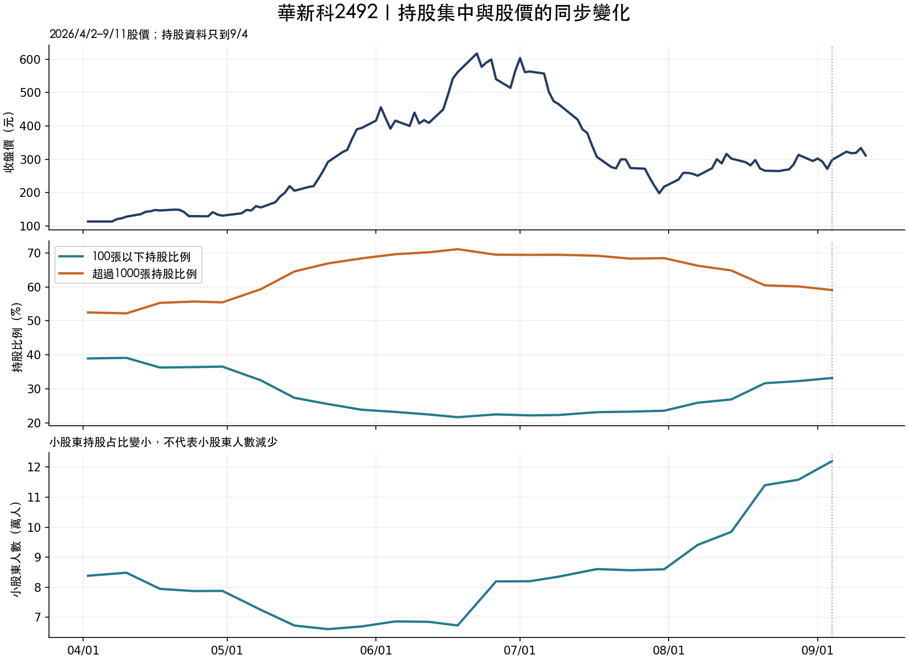

# 華新科2492：2026/4/2之後的小股東、大戶與股價

**上漲段確實曾出現小股東減少、大戶集中；回跌後又反轉。從4/2到最新觀測的持股占比下降，但小股東人數增加，所以必須分階段看。目前不足以支持這個現象是穩定的提前買入訊號。**

| 項目 | 2026/4/2 | 2026/9/4最新持股觀測 | 變化 |
|---|---:|---:|---:|
| 未還原收盤價 | 114.00 | 298.50 | +184.50 |
| 100張以下持股比例 | 38.94% | 33.18% | -5.76個百分點 |
| 超過1000張持股比例 | 52.48% | 59.07% | +6.59個百分點 |
| 100張以下人數 | 83,844 | 122,029 | +38,185 |
| 超過1000張人數 | 29 | 38 | +9 |
| 100張以下持有股數 | 189,188,441 | 161,005,073 | -28,183,368 |
| 超過1000張持有股數 | 254,948,860 | 286,618,015 | +31,669,155 |
| 集保庫存股數 | 485,804,774 | 485,204,774 | -600,000 |

股價資料另更新至9/11收盤311.5元，相對4/2未還原價格變動+173.25%，FinMind還原價格變動+174.70%；同期0050還原變動+46.53%。這不是扣交易成本的帳戶報酬。9/11沒有新的持股觀測，不能把9/4持股比例標為9/11最新股權。

事後分段可見：大戶比例最高的週觀測為2026-06-18，股價561元、大戶71.11%、小股東21.63%及67,277人；相對4/2，當時確實是大戶更集中、小股東比例與人數都下降。到9/4股價回落，大戶比例降低、小股東人數增加。這個中間日期是在看完資料後取最大值，只用來解釋圖形，不能當事先知道的高點或出場規則。



## 同步變化，與提前訊號，是兩個問題

先固定看四週持股比例變動。同期相關衡量已發生的四週行情；領先分析則等持股觀測日加7日後的下一市場日，才開始衡量後20／40／60市場日還原股價變動。末端不夠完整持有期就排除，沒有補到最新日充當完整報酬。

| 2026/4/2起的比較 | 有效週數 | 千張大戶變化相關 | 小股東變化相關 |
|---|---:|---:|---:|
| 同期四週 | 23 | +0.654 | -0.663 |
| 可用後20市場日 | 18 | +0.075 | -0.049 |
| 可用後40市場日 | 15 | -0.454 | +0.493 |
| 可用後60市場日 | 10 | -0.939 | +0.939 |

相關係數為Spearman，範圍−1至1，不能當作勝率。同期大戶變化與漲幅同向、小股東比例與漲幅反向；移到之後的20日，關係接近零。40／60日呈反向，但樣本少且高度重疊，不能據此改成反向交易。

## 「大戶增加且小股東減少」交集，比沒有出現時更好嗎？

| 觀測期／公布延遲假設 | 成立週數 | 成立後20日平均變動 | 不成立週數 | 不成立後20日平均變動 |
|---|---:|---:|---:|---:|
| 2026/4/2起／加7日再等下一市場日 | 11 | +54.08% | 7 | +11.85% |
| 2026/4/2起／加14日再等下一市場日 | 11 | +32.56% | 6 | +40.87% |
| 2022–2025同股對照／加7日再等下一市場日 | 67 | +0.47% | 129 | +0.36% |
| 2022–2025同股對照／加14日再等下一市場日 | 67 | +0.98% | 128 | -0.22% |

7日假設下2026交集看起來較好，但多延一週後方向翻轉；2022–2025的同股對照優勢很弱。這些週可能共同涵蓋同一波大漲，不能把11筆當成11次獨立成功交易。2022–2025對照的未來價格也截在2025年底，沒有混入2026行情。

較合理的用途，是把持股集中列為行情背景或候選解釋，再配合可交易的價格與成交證據；本輪不把它設成必買條件，也不從這次反向相關發明放空策略。

## 資料核對與限制

- 小股東是100張以下，含恰好100張；現有級距不能剔除剛好100張。千張級以1,000,001股起的最高級距計算。每張1000股。
- 持股比例用各級股數除以集保庫存重新計算，再核對FinMind各級已四捨五入的percent。完整15級、排除total／差異調整，合計、人數及級距比例均核對；本次646筆歷史週觀測沒有格式不合格，但不表示2010至今每週都完整。
- 分母是集保庫存，不是必然等於公司已發行股數。研究期庫存由485,804,774股降至485,204,774股；同時大戶實際股數增加31,669,155股，小股東實際股數減少28,183,368股，因此不只是分母略降產生的比例幻象。未逐案查明所有庫存變化的原因。
- FinMind股利資料列2026/7/9現金除息，每股2.50309147元，7/29發放；原價與還原價分開列。還原版本未完成另一家價格供應商逐日對帳，不宣稱精確實收總報酬。
- 集保按每週最後營業日餘額、ID歸戶編製。級距只能表示人數與持股分布，無法辨認是否同一批大戶、主力身分或資金來源。已聚合比例不等於個別投資人的買賣紀錄。
- 7／14日只是公布可用時間假設，沒有歷史首次發布時間。4/2觀測不能當4/2收盤前就知道。只有23週主樣本，且股票與起點已由使用者事後指定；沒有全市場或未見樣本外證據。
- Goodinfo網頁直接抓取回403，本輪沒有繞過限制，也沒有宣稱完成Goodinfo數值交叉驗證。數值來源是FinMind；級距加總是內部一致性檢查，非第二資料商驗證。

來源：[FinMind持股分級](https://finmind.github.io/tutor/TaiwanMarket/Chip/)、[FinMind還原價格](https://finmind.github.io/tutor/TaiwanMarket/Technical/)、[TDCC編製說明](https://original-www.tdcc.com.tw/portal/zh/smWeb/qryStock)。

## 交付與重現

Git保存本報告、23週表格、圖、全部診斷摘要及來源hash；原始資料在`.cache/holder-case-2492/`，完整逐週可用日期與診斷在`.cache/holder-analysis-2492/`。原始兩次請求已在上一輪備妥，本輪另加三次：2492與0050還原價、2492股利；共享額度／快取，沒有重抓全市場。

```bash
python scripts/research_holder_2492.py --verify
python scripts/research_holder_2492.py
```

## 軟體驗收

`make test`：2205項通過、28項警告；pipeline通過，既有make api服務的health／picks／models／jobs四項curl回200。新研究畫面已驗證7種情境、23週表格、情境切換及3個CSV下載入口，初次來源驗證約7.13秒，切換約0.79秒。舊父研究與本輪來源hash均通過。
