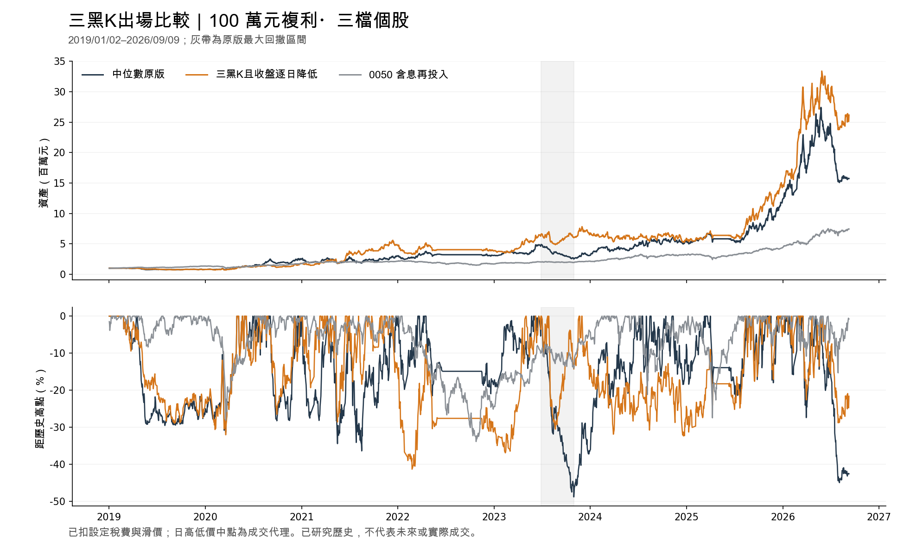

# 三根黑K且收盤逐日降低：完整帳戶回測

研究日期：2026-10-01。**2019-01-02 至 2026-09-09，本金100萬元複利、三個主要個股名額、閒置現金**；三根黑K出場替代上一輪新增的均線轉弱條件，原12%收盤停損與63交易日到期仍優先。少量待清零股可另外留在帳上，0050是獨立比較帳戶。

**本輪單一規則有改善：扣設定成本累積報酬由+1,472.77%升至+2,515.74%，最大回撤由−48.87%縮至−41.38%。** 100萬元期末成為26,157,424.44元，較原版高66.31%，回撤改善7.49個百分點。這是已研究過的歷史結果；仍有四成回撤、換手增加及部分年份退步，沒有升級為實盤資格。

## 完整比較

| 版本 | 累積淨報酬 | 期末資產（元） | 最大回撤 | 買入批次 | 成交筆數 | 總成本（元） | 贏0050年度 |
| --- | --- | --- | --- | --- | --- | --- | --- |
| 中位數原版 | +1472.77% | 15,727,739.91 | -48.87% | 130 | 742 | 2,711,059 | 4/8 |
| 三黑K且收盤逐日降低 | +2515.74% | 26,157,424.44 | -41.38% | 248 | 1380 | 6,635,640 | 6/8 |
| 0050 含息再投入 | +643.31% | 7,433,139.81 | -33.91% | 0 | 54 | 9,584 | — |

期末資產包含剩餘持股估值，沒有假設全數清倉。0050含息再投入；所有帳戶依既有規則計入成本。三黑K版本的期末待收權益為零。買入批次不等於當日同時持有248檔，成交筆數包含部分成交與普通盤／零股分開成交。

## 明確的出場規則

1. 連續三個**交易日**，每根原始收盤價嚴格低於當日開盤價。
2. 這三天每一天的**還原收盤價**都低於前一交易日，因此需要三根K、四個收盤觀察值。跨日用還原收盤，避免把除權息的機械降價誤當轉弱。
3. 三根K均須在實際買入當日或之後，且有正成交量。十字線、必要值缺失或零量會打斷；數值相等在1e-12容差內不算下降。使用的完整K棒若開收盤超出當日高低範圍，直接阻擋回測。
4. 第三根**收盤後**確認，**下一交易日提出全部賣出**，未成交部分繼續處理。原12%停損或63日到期先觸發時，不再等待三根黑K。12%沿用買入首日還原收盤參考價，並非成交成本或實際損失保證上限。
5. 這不疊加上一輪的MA20轉弱出場；買點、候選池、排序、流動性、資金分配與三個主要名額均不改。本輪沒有再搜尋K棒根數、跌幅或其他門檻。

例如5305敦南2019/2/27、3/4、3/5的開／收盤依序為35.70／35.05、35.35／35.00、35.00／34.40，還原收盤亦逐日下降；3/5收盤確認，3/6提出出場。中間休市不算交易日，不需要三個日曆日連續。

## 是否會再買回

**會，但必須重新出現原選股法的買訊**，並有資金、名額及成交容量；不是反彈一天就自動買回，也沒有永久排除已賣出的股票。

整段有26個因三黑K退出的批次，之後再次買進同一股票。例：6147頎邦於2026/5/14確認，5/15賣完；5/18有新的原策略訊號，5/19重新買進。這是26個退出批次的後續買入，不是26個互不重複的股票或額外買回策略。

## 回撤是否真的改善

原版最大回撤區間2023/6/29–10/31，原版−48.87%、三黑K帳戶−9.04%、0050−4.70%。但三黑K版本自己最差的區間移到了**2021/12/13–2022/2/24**：資產從5,580,145.97元降到3,271,146.03元，回撤41.38%；直到2023/5/2才恢復前高，從高點算起331個交易日。原版自身最差區間的恢復時間是236日，兩者是不同市場區間，不能說所有風險指標都改善。

新帳戶在原版2023高點沒有持有原版亞航那一批；必應也在不同日期進場，於7/5出現三黑K後，在7/6–7/7分批退出。因此改善包含提早出場後的名額、持股與資金路徑變化，不能全部說成同兩筆持股單純賣得較早。

平均已交付股票比重由73.10%降到68.83%；已結束批次勝率由44/127（34.65%）變為89/245（36.33%），仍有156個虧損批次。較好的累積報酬不是每筆都賺錢。

## 年度與連續分段

| 版本 | 2019 | 2020 | 2021 | 2022 | 2023 | 2024 | 2025 | 2026至9/9 |
| --- | --- | --- | --- | --- | --- | --- | --- | --- |
| 中位數原版 | -21.49% | +215.47% | +21.50% | +2.10% | +0.74% | +82.92% | +116.73% | +28.17% |
| 三黑K且收盤逐日降低 | -21.73% | +126.95% | +170.24% | -20.15% | +69.17% | -8.80% | +145.17% | +80.41% |
| 0050 含息再投入 | +34.01% | +31.16% | +22.05% | -21.32% | +27.44% | +48.36% | +36.80% | +70.25% |

| 版本 | 2019–2021 | 2022–2024 | 2025–2026/9/9 |
| --- | --- | --- | --- |
| 中位數原版 | +200.93% | +88.14% | +177.79% |
| 三黑K且收盤逐日降低 | +380.05% | +23.19% | +342.30% |
| 0050 含息再投入 | +114.53% | +48.77% | +132.89% |

三黑K版本有6/8年度高於0050，但2024年−8.80%，明顯差於原版+82.92%與0050+48.36%；2022–2024整段也落後0050。各段沿用同一個複利帳戶、不重置本金，也不是未見樣本。

## 保留下來與提早賣掉的波段

以下比較與原版五個最大獲利波段在日期上重疊的同股票批次，允許不同日進場。金額是整批淨損益，包含資金量與持有日期差異，不是共同固定本金的純出場效果。

| 原版主要波段 | 原版淨利（元） | 三黑K帳戶對應批次淨利（元） |
| --- | --- | --- |
| 5386 青雲 | 11,400,508 | 5,051,967 |
| 2408 南亞科 | 3,230,402 | 3,902,617 |
| 2344 華邦電 | 2,553,963 | 434,775 |
| 8358 金居 | 1,805,446 | 2,095,116 |
| 8299 群聯 | 1,552,482 | 未買到重疊波段 |

青雲兩版本都是2026/2/10進場：原版最終5/26賣完，該批扣費報酬+276.92%；三黑K版4/9賣完，該批+108.02%。新規則也會提早賣掉繼續上漲的股票，不能據此宣稱能完整吃到所有漲幅。

2021年新帳戶的四維航、宏觀與萬海批次合計獲利約244.74萬元，這是該年改善的重要組成；但這些是事後歸因，沒有把指定股票加入策略例外。

## 成交時序與成本

- 共獨立重建4,367個持有期間判斷，確認183個三黑K觸發；對應657筆賣出成交，因部分成交／分渠道而多於觸發次數。所有三黑K賣出都必須有較早收盤的完整訊號。
- 買賣沿用**次日各渠道日高低價中點**代理，加每邊0.45%滑價、0.1425%佣金、每渠道最低20元；個股賣出稅0.3%，0050按既有ETF稅率。普通盤與零股各有1%成交容量，未成交保留，2020/10/26以前採盤後零股。這不是可預先知道的委託價或已核實真人成交。
- 例：青雲2026/3/24、3/25、3/26確認三黑K；3/27已提出賣單，但普通盤與零股高低均為跌停價260.5，既有成交規則標為`midpoint_limit_not_crossed`而未成交。3/30才開始分批成交，直到4/9賣完。沒有額外延後訊號，也沒有假設跌停時必定能賣掉。
- 所有實際模擬成交的參與率均核對為1%；為保留原版帳戶逐欄重現，舊設定中的`odd_participation=0.05`原字樣保留，發布檔明示它不是此版實際使用的容量。
- 總成本由2,711,059元增至6,635,640元，已從績效扣除；它同時受更多交易與較大的複利資產影響。個人股利稅、補充保費與未核實郵匯費未完整模擬。

## 資料修正與核對

補上6409旭隼2019年配股交付資料：官方股利表列2019/9/2除權、10/25發放；公司公告列面額10元、零碎股按面額折現至整元。比例沿用凍結FinMind精確值0.05000000635。此路徑只持有1股，配股不到1股且折現為0元，未知零碎股款付款日仍標為不可用，不假造已確認日期。[旭隼官方股利資料](https://voltronicpower.com/zh-TW/Investors/Financial-Information)，[發行公司公告轉載](https://tw.stock.yahoo.com/news/%E6%97%AD%E9%9A%BC%E8%91%A3%E4%BA%8B%E6%9C%83%E6%B1%BA%E8%AD%B0%E7%9B%88%E9%A4%98%E8%BD%89%E5%A2%9E%E8%B3%87%E7%99%BC%E8%A1%8C%E6%96%B0%E8%82%A1%E6%A1%883-934-262%E8%82%A1-221728699.html)。

準備階段的獨立核帳攔下零值配股重新建立空持股、將實際10/1出場誤記成10/25的問題。修正後仍保留零股數交付紀錄，卻不重建空持股或改寫原退出日；不影響真實新股及現金交付。

第一輪同時回放另攔下一次讀到未寫完股利副本的錯誤；已改為準備時完整寫好後才發布、正式回放只讀。保留當時失敗與成功結果，修正後新帳戶也必須完全等於首次完整三黑K帳戶，沒有藉機改交易條件。

最終三組各兩次完整離線回放（final-c／final-d），核對帳本、成交、稅費、公司行動、現金、名額與每日資產；各來源集合共36,150項一致，355份股利副本的內容與修改時間均未變。原版與0050另逐欄等於以前封存的帳戶。

共保存16筆執行紀錄：4筆準備、12筆正式帳戶回放，含4筆失敗／中止紀錄；只增加一個新交易假說。來源準備54次嘗試，其中21次FinMind、30次官方零股、3次公司公告／文件，低於500次預設上限。這是來源嘗試數，不等於供應商計費次數；FinMind沿用每小時5,400次共用限制，沒有自動重試，正式回放不連網，也未重訓模型。

最後整合後完整`make test`為**4,273項通過**；`make pipeline`完成並可重跑，本輪共四次成功。新啟動8001及既有8000的health、picks、models、jobs四端點均HTTP200，僅停止本次測試程序。沒有下單或啟動排程。

本次核對涵蓋這些固定帳戶路徑。完整歷史市場身分仍屬重建、其他未使用股票不代表已全部修復；日資料不能證明實際排隊成交。所有年份已研究過，因此仍是 **`live_qualified=false`、`actual_fill_verified=false`、`unseen_validation=false`**。本輪結論為保留三黑K作為較原版更好的歷史研究候選，尚不宣稱長期穩定或正式實盤合格。

## 紀錄與重現

- [完整比較與來源](../artifacts/forward_simulation/three_black_exit_20261001.json)、[年度結果](../artifacts/forward_simulation/three_black_exit_20261001/annual.csv)、[連續三段](../artifacts/forward_simulation/three_black_exit_20261001/periods.csv)。
- [三黑K每日資產](../artifacts/forward_simulation/three_black_exit_20261001/three_black-daily.csv)、[全部買賣](../artifacts/forward_simulation/three_black_exit_20261001/three_black-trades.csv)、[買入批次](../artifacts/forward_simulation/three_black_exit_20261001/three_black-cohorts.csv)、[全部委託及未成交](../artifacts/forward_simulation/three_black_exit_20261001/three_black-orders.csv)。同目錄含原版與0050的資產、持股及現金帳。
- [回撤與批次歸因](../artifacts/forward_simulation/three_black_exit_20261001_analysis.json)、[全部訊號決策](../artifacts/forward_simulation/three_black_exit_20261001/three_black-decisions.json)、[觸發實例與26筆買回](../artifacts/forward_simulation/three_black_exit_20261001_exit_evidence.json)。
- [所有試次與失敗紀錄](../artifacts/forward_simulation/three_black_exit_20261001_trials.json)、[專案驗收](../artifacts/forward_simulation/three_black_exit_20261001_acceptance.json)、[事前規格及技術修正記錄](prereg_three_black_exit_20261001.md)、[新增公司行動來源](three_black_corporate_terms_20261001.json)。

離線入口：`python scripts/research_three_black_exit.py --output <新目錄>`；輸出限定本研究快取目錄，禁止覆蓋舊結果。兩次完整結果由`export_three_black_exit.py`核對匯出，`analyze_three_black_exit.py`重建回撤與批次損益，`plot_three_black_exit.py`畫圖。換機仍需搬移來源快取並核對雜湊，只有報告不能宣稱可重現。
